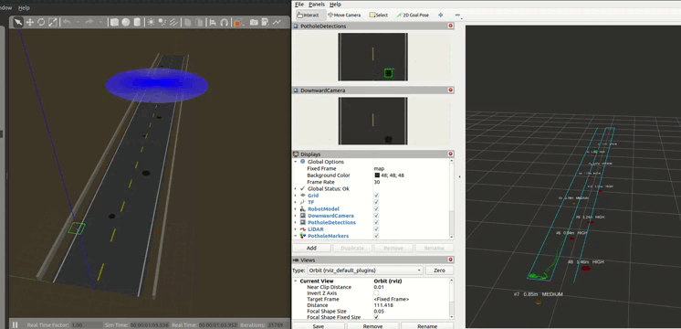

# PhoenixDrone - Autonomous Road Pothole Survey

A ROS 2 Humble and Gazebo Classic 11 simulation of a quadrotor that flies an
autonomous survey over a road, detects potholes with its downward camera, and
produces a georeferenced pothole map with WGS-84 coordinates.

Validated end to end against the world's ground truth:

```
 survey               completes the full lawnmower pattern, then lands
 potholes found       10 / 10       precision 1.00   recall 1.00   F1 1.00
 localisation error   0.01 m mean (worst 0.03 m)
 diameter error       0.11 m mean
 goal navigation      7 / 7 goals reached, 0.03 m mean error, 4-9 s each
 altitude hold        +/- 0.06 m
```

## Architecture

The simulation stack has three layers:

1. Gazebo Classic 11 runs the `pothole_road` world (100 m road, 10 potholes,
   obstacles) and the PhoenixDrone model, which carries a downward camera,
   LiDAR, IMU, GPS and ground-truth odometry, all published under `/phoenix/*`.
2. The control layer (`flight_controller` and `road_survey`) commands the
   drone through Gazebo's `apply_link_wrench` service using a cascade PID,
   following either the autonomous lawnmower survey pattern or externally
   published goal poses.
3. The perception layer (`pothole_detector` and `pothole_mapper`) runs
   detection on each camera frame, projects detections onto the road plane,
   fuses repeated sightings, and publishes a georeferenced map as JSON plus a
   human-readable report.

## Packages

| Package | Description |
|---------|-------------|
| `phoenix_drone_description` | SDF drone model (single rigid body, 4 sensors) and URDF for TF |
| `phoenix_drone_gazebo` | Generated pothole-road world and ground-truth manifest |
| `phoenix_drone_control` | PID flight controller, autonomous survey, odom-to-TF bridge |
| `phoenix_drone_perception` | Pothole detection, ground projection, georeferenced mapping |
| `phoenix_drone_bringup` | Master launch file and RViz config |

## Prerequisites

Already satisfied on a standard ROS 2 Humble desktop install:

```bash
sudo apt install ros-humble-desktop ros-humble-gazebo-ros-pkgs \
                 ros-humble-gazebo-ros ros-humble-cv-bridge
```

Optional, for YOLOv8 instead of the built-in classical detector:

```bash
pip install ultralytics
```

NumPy note: `cv_bridge` on Humble is compiled against NumPy 1.x. If a
NumPy 2.x is installed, the detector automatically skips `cv_bridge` and uses
an equivalent built-in NumPy image conversion. No action needed; detection is
unaffected.

## Build

```bash
cd ~/Desktop/drone
colcon build --symlink-install
source install/setup.bash
```

## Run

```bash
# Everything: world, drone, autonomous survey, detection and mapping
ros2 launch phoenix_drone_bringup full_simulation.launch.py

# With RViz (markers, survey path, camera, LiDAR)
ros2 launch phoenix_drone_bringup full_simulation.launch.py rviz:=true

# Headless (no Gazebo GUI), much faster
ros2 launch phoenix_drone_bringup full_simulation.launch.py gui:=false

# Fly manually instead of surveying (send goals from RViz "2D Goal Pose")
ros2 launch phoenix_drone_bringup full_simulation.launch.py survey:=false rviz:=true

# Use a trained YOLOv8 pothole model
ros2 launch phoenix_drone_bringup full_simulation.launch.py \
    use_yolo:=true model_path:=/path/to/best.pt
```

### Launch arguments

| Argument | Default | Meaning |
|----------|---------|---------|
| `gui` | `true` | Show the Gazebo client |
| `rviz` | `false` | Launch RViz2 |
| `perception` | `true` | Run detection and mapping |
| `survey` | `true` | Run the autonomous lawnmower survey |
| `altitude` | `6.0` | Cruise altitude, metres AGL |
| `use_yolo` | `false` | YOLOv8 instead of the classical CV detector |
| `model_path` | `''` | Path to a trained `.pt` model |

### Individual components

```bash
ros2 launch phoenix_drone_gazebo simulation.launch.py      # world + drone only
ros2 launch phoenix_drone_control control.launch.py        # controller + survey
ros2 launch phoenix_drone_perception perception.launch.py  # detection + mapping
```

### Flying to a goal

With RViz open, click "2D Goal Pose" and click anywhere on the map; the drone
flies there and holds position. The goal's arrow sets the heading, and the
drone keeps its cruise altitude (RViz sends z = 0, which the controller reads
as "hold current cruise height").

From the command line, publish the same message. A non-zero `z` commands a
specific altitude:

```bash
# Fly to (35, -3) at cruise altitude, facing +X
ros2 topic pub --once /goal_pose geometry_msgs/PoseStamped \
  "{header: {frame_id: 'map'}, pose: {position: {x: 35.0, y: -3.0, z: 0.0},
    orientation: {w: 1.0}}}"

# Same spot but at 9 m altitude
ros2 topic pub --once /goal_pose geometry_msgs/PoseStamped \
  "{header: {frame_id: 'map'}, pose: {position: {x: 35.0, y: -3.0, z: 9.0},
    orientation: {w: 1.0}}}"
```

Goals are idempotent: re-sending the same one does not disturb the flight,
which is what lets the survey node stream its current waypoint continuously.

Run with `survey:=false` if you want manual control without the autonomous
survey competing for the goal.

### Manual flight commands

```bash
ros2 topic pub --once /phoenix/flight_command std_msgs/String "{data: 'TAKEOFF'}"
ros2 topic pub --once /phoenix/flight_command std_msgs/String "{data: 'HOVER'}"
ros2 topic pub --once /phoenix/flight_command std_msgs/String "{data: 'RTL'}"
ros2 topic pub --once /phoenix/flight_command std_msgs/String "{data: 'LAND'}"

# Survey control
ros2 topic pub --once /phoenix/survey/command std_msgs/String "{data: 'RESTART'}"
```

## Verifying it works

```bash
# Flies a survey headless, then checks flight, sensors and mapping (10 checks)
bash scripts/smoke_test.sh 300

# Point-to-point goal navigation, RTL and landing (7 checks)
bash scripts/test_goto.sh

# Scores the produced map against the world's ground truth
python3 scripts/score_map.py

# Unit tests for the projection and geodesy maths
python3 -m pytest phoenix_drone_perception/test/test_geo_utils.py -q
```

`smoke_test.sh` prints a pass/fail table; `score_map.py` reports precision,
recall and per-pothole localisation error.

## Topics

| Topic | Type | Description |
|-------|------|-------------|
| `/phoenix/camera/image_raw` | `sensor_msgs/Image` | Downward camera (640x480, 15 Hz) |
| `/phoenix/camera/camera_info` | `sensor_msgs/CameraInfo` | Intrinsics |
| `/phoenix/lidar/scan` | `sensor_msgs/LaserScan` | 360 degree 2D LiDAR |
| `/phoenix/imu/data` | `sensor_msgs/Imu` | IMU |
| `/phoenix/gps/fix` | `sensor_msgs/NavSatFix` | GPS |
| `/phoenix/ground_truth/odom` | `nav_msgs/Odometry` | Ground-truth pose |
| `/phoenix/odom` | `nav_msgs/Odometry` | Re-stamped odometry (`odom` to `base_link`) |
| `/phoenix/flight_state` | `std_msgs/String` | IDLE / TAKEOFF / HOVER / NAVIGATE / LAND |
| `/phoenix/flight_command` | `std_msgs/String` | TAKEOFF / HOVER / LAND / RTL |
| `/phoenix/goal_pose` | `geometry_msgs/PoseStamped` | Waypoint from the survey |
| `/phoenix/target_pose` | `geometry_msgs/PoseStamped` | Controller's active target |
| `/phoenix/survey/status` | `std_msgs/String` | Survey progress |
| `/phoenix/survey/path` | `nav_msgs/Path` | Planned lawnmower pattern |
| `/phoenix/perception/detections` | `std_msgs/String` | Detections as JSON (bboxes + stamp) |
| `/phoenix/perception/annotated_image` | `sensor_msgs/Image` | Detection overlay |
| `/phoenix/pothole_map` | `std_msgs/String` | Full georeferenced map (JSON) |
| `/phoenix/pothole_markers` | `visualization_msgs/MarkerArray` | Map markers for RViz |
| `/phoenix/navigation/telemetry` | `std_msgs/String` | Unified telemetry (JSON) |

## Outputs

- `/tmp/pothole_map.json`: machine-readable map (world XY, lat/lon, diameter,
  severity, sighting count)
- `/tmp/pothole_report.txt`: human-readable survey report

## How the mapping works

1. Detect: the detector finds potholes in each camera frame. Without a
   trained model it uses an adaptive classical-CV detector: it estimates the
   road's brightness from the image median, thresholds significantly darker
   regions, and filters by circularity, solidity, aspect ratio and darkness
   contrast, which rejects lane markings and shadows.
2. Project: each detection's pixel centre is projected onto the road plane
   using the camera intrinsics and the drone's altitude and heading. The pose
   is looked up at the frame's own timestamp from a short pose history, so
   motion during inference does not smear one pothole into a trail.
3. Fuse: sightings within 1.5 m are merged with a running average; a pothole
   is confirmed after 3 independent sightings, which suppresses one-frame
   artefacts.
4. Georeference: world ENU metres are converted to WGS-84 latitude and
   longitude using local radii of curvature about the world origin (New
   Delhi, 28.6139 N, 77.2090 E).

Severity is graded by estimated diameter: HIGH >= 0.9 m, MEDIUM >= 0.5 m,
otherwise LOW.

## The world

Generated by `phoenix_drone_gazebo/scripts/generate_world.py`, which also
writes `config/pothole_ground_truth.json` so mapping accuracy can be scored
objectively. To change the layout, edit the `POTHOLES` list and regenerate:

```bash
python3 phoenix_drone_gazebo/scripts/generate_world.py \
        phoenix_drone_gazebo/worlds/pothole_road.world
mv phoenix_drone_gazebo/worlds/pothole_ground_truth.json \
   phoenix_drone_gazebo/config/
colcon build --symlink-install --packages-select phoenix_drone_gazebo
```

Contents: a 100 m by 10 m asphalt road with dashed centreline and edge lines,
10 recessed potholes (0.3-1.3 m diameter, 5-15 cm deep), dirt shoulders,
concrete barriers and bollards for LiDAR obstacle testing.

## Implementation notes

Several non-obvious things were needed to make this stable; they are worth
knowing before changing the code.

- Sensors live directly on `base_link`. Mounting them on separate links
  joined by fixed joints gave ODE a mass ratio of 150:1 and an inertia ratio
  of about 3500:1, which made the solver diverge into NaN after 15-25 s of
  hover. Keep the model a single rigid body.
- Wrenches must be continuous. Gazebo Classic silently drops a wrench whose
  duration is shorter than one physics step. The controller applies a
  continuous wrench (`duration = -1`) and refreshes it at 20 Hz, clearing the
  previous one first. Clearing must use `LinkRequest` on
  `/clear_link_wrenches`; `BodyRequest` does not cancel the force.
- XY guidance is cascaded. Position error becomes a capped desired velocity,
  which then drives a velocity loop. A direct position-to-force term
  accelerated without bound between 10 m-apart waypoints (84 m/s was
  observed).
- Integral gains are small and anti-wound. Integration only happens near the
  target and while unsaturated.
- `velocity_decay` is applied per physics step, not per second. The effective
  damping rate is `<linear> * step_rate`, so at 500 Hz a value of 0.02 is a
  damping rate of 10/s, which capped horizontal speed at 1.3 m/s and made the
  drone crawl (44 s to cross 18 m). The model now uses 0.001 (0.5/s); the
  same goal takes 6 s.
- Image +v points backward. With the camera rotated 90 degrees about Y, the
  image's down axis maps to body -X. Getting this sign wrong put every
  pothole about 4 m from its true position; `test_geo_utils.py` pins it with
  a regression test taken from a real simulator frame.
- Camera, CameraInfo and GPS publish RELIABLE. Subscribing BEST_EFFORT is an
  incompatible-QoS match and silently receives nothing.

### GUI tools and snap

If `rviz2`, `gzclient` or `rqt` fail with

```
symbol lookup error: /snap/core20/.../libpthread.so.0: undefined symbol: __libc_pthread_init
```

then the shell has inherited a snap-confined environment, for example an
integrated terminal inside snap-installed VS Code. Every Qt/GL tool fails the
same way (`rviz2`, `gzclient`, `rqt_image_view`), because snap's `core20`
runtime libraries shadow the system ones for anything launched from that
shell.

This is an environment problem, not a configuration one, and it cannot be
undone from inside the affected shell (unsetting `LD_LIBRARY_PATH` does not
fix it; the runtime is injected by the snap confinement itself). Run the GUI
from a normal system terminal (GNOME Terminal, a TTY, or a terminal in a
non-snap editor):

```bash
cd ~/Desktop/drone && source install/setup.bash
ros2 launch phoenix_drone_bringup full_simulation.launch.py rviz:=true
```

Headless runs (`gui:=false`) are completely unaffected, which is how the
verification scripts run.

## License

MIT
